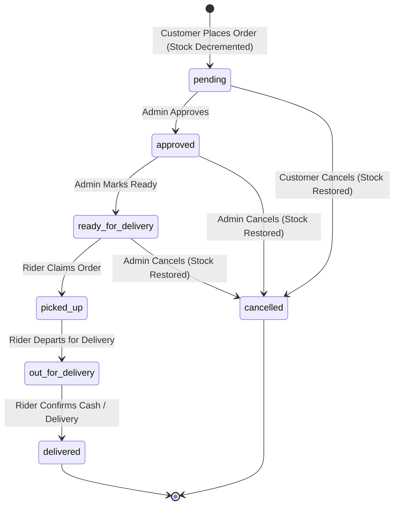

# LPG Delivery & Inventory Management System v2

[](https://www.php.net/)
[](https://www.mysql.com/)
[](https://getbootstrap.com/)
[](https://jquery.com/)
[-2ea44f?style=flat&logo=githubactions&logoColor=white)](#automated-test-suite)
[]( #security-architecture)

> **LPG Delivery System v2** is a modular, high-concurrency e-commerce and logistics management platform engineered for LPG cylinder distribution businesses. Built with native PHP 8+, MySQL (InnoDB), Bootstrap 5.3, and jQuery 3.7, it features role-based access control, pessimistic row-level locking, automated stock restoration, CSRF defense, rate-limiting, and comprehensive REST APIs.

---

## Table of Contents

1. [Project Overview & v1 vs v2 Comparison](#project-overview--v1-vs-v2-comparison)
2. [Key Architecture & Design Principles](#key-architecture--design-principles)
3. [Technology Stack](#technology-stack)
4. [Directory & File Structure](#directory--file-structure)
5. [Installation & XAMPP Setup](#installation--xampp-setup)
6. [Default Seed Credentials](#default-seed-credentials)
7. [Security Architecture & OWASP Mitigations](#security-architecture--owasp-mitigations)
8. [Order Lifecycle & State Machine](#order-lifecycle--state-machine)
9. [REST API Documentation](#rest-api-documentation)
10. [Automated Test Suite](#automated-test-suite)

---

## Project Overview & v1 vs v2 Comparison

The legacy Version 1 codebase was a client-heavy, non-transactional prototype lacking data isolation, prepared statements, and transactional safety. Version 2 is an enterprise-grade rewrite designed for reliability, concurrency safety, and security.

### Comparison Matrix

| Feature / Dimension | Version 1 (Legacy) | Version 2 (Modern Engine) |
| :--- | :--- | :--- |
| **Architecture** | Single-script UI with basic PHP snippets | Modular MVC-inspired structure with OOP Models, Singleton DB, and Middleware |
| **Database Safety** | Plain SQL string concatenation | 100% PDO Prepared Statements (`EMULATE_PREPARES => false`, strict type bindings) |
| **Concurrency & Race Conditions** | Unprotected; high risk of overselling & dual-claiming | Transactional row-level pessimistic locking (`SELECT ... FOR UPDATE`) |
| **Inventory Management** | Manual adjustment without transaction rollback | Atomic decrement on purchase; atomic rollback & stock restoration on cancellation |
| **Password Security** | Plaintext / Weak MD5 hashes | Bcrypt (`PASSWORD_BCRYPT` with cost factor 12) |
| **CSRF Defense** | No protection | Cryptographically secure 64-hex tokens validated on all state-changing requests & AJAX |
| **Rate Limiting** | None | Sliding-window attempt throttling across authentication and password resets |
| **Role-Based Access (RBAC)** | Minimal client-side checks | Server-side route guards (`require_role()`, `require_login()`, `require_guest()`) |
| **File Upload Validation** | Extension-only check | MIME type sniffing (`finfo_file`), magic-byte inspection, strict whitelisting & isolated storage |
| **User Portals** | Monolithic interface | Dedicated responsive portals for Customer, Rider, and Admin |
| **REST APIs** | Unstructured responses | Standardized JSON envelopes (`{success, data, message, error}`) with HTTP status codes |
| **Automated Testing** | No test suite | Master test runner executing 9 automated test suites with 233 passing test cases |

---

## Key Architecture & Design Principles

```
  ┌─────────────────────────────────────────────────────────────┐
  │                         Browser / Client                    │
  │   Bootstrap 5.3.3 UI  │  jQuery 3.7.1 AJAX  │  Vanilla JS   │
  └──────────────────────────────┬──────────────────────────────┘
                                 │ HTTP Requests (CSRF + Session)
                                 ▼
  ┌─────────────────────────────────────────────────────────────┐
  │                   Includes & Middleware                     │
  │   auth.php   │   middleware.php (RBAC / CSRF / Rate Limit)  │
  │   helpers.php (XSS Sanitization, Session, Flash, Formats)   │
  └──────────────┬──────────────────────────────┬───────────────┘
                 │                              │
         Direct Web Requests              AJAX API Requests
                 ▼                              ▼
  ┌──────────────────────────────┐ ┌────────────────────────────┐
  │     Pages Layer (HTML/PHP)   │ │      REST API Endpoints    │
  │  • Customer Portal           │ │  • /api/orders.php         │
  │  • Rider Delivery Portal     │ │  • /api/products.php       │
  │  • Admin Dashboard & KYC     │ │  • /api/users.php          │
  └──────────────┬───────────────┘ └────────────┬───────────────┘
                 │                              │
                 └──────────────┬───────────────┘
                                │
                                ▼
  ┌─────────────────────────────────────────────────────────────┐
  │                    OOP Model Layer (Classes)                │
  │   Database (Singleton PDO)  │  User  │  Product  │  Order   │
  │   Mailer (SMTP / Mock Email Transporter)                   │
  └──────────────────────────────┬──────────────────────────────┘
                                 │
                                 ▼
  ┌─────────────────────────────────────────────────────────────┐
  │                     MySQL Database Engine                   │
  │   InnoDB Engine  │  ACID Transactions  │  Foreign Keys     │
  │   Pessimistic Row-Level Locks (SELECT ... FOR UPDATE)       │
  └─────────────────────────────────────────────────────────────┘
```

---

## Technology Stack

- **Backend:** PHP 8.0+ (Native OOP, PDO MySQL driver, OpenSSL, Fileinfo)
- **Database:** MySQL 5.7+ / 8.0+ or MariaDB 10.4+ (InnoDB, `utf8mb4_unicode_ci`)
- **Frontend Framework:** Bootstrap 5.3.3 & Bootstrap Icons 1.11.3
- **JavaScript Library:** jQuery 3.7.1
- **Email Delivery:** Custom `Mailer` with SMTP TLS/SSL and zero-dependency mock testing support
- **Testing:** Custom zero-dependency PHP CLI Test Harness & Aggregator

---

## Directory & File Structure

```
lpg-delivery-system-repo/
├── .htaccess                 # Main Apache configuration (URL rewrites, headers)
├── README.md                 # Project documentation
├── index.php                 # Landing page & user login form
├── register.php              # Customer registration with KYC ID upload
├── forgot-password.php       # Password reset request initiator (with rate limiting)
├── reset-password.php        # Password reset token confirmation form
├── logout.php                # Secure session destruction & redirect
│
├── api/                      # Hardened JSON REST Endpoints
│   ├── .htaccess             # Restricts directory indexing & enforces headers
│   ├── orders.php            # Order actions: claim, update_status, cancel, get_order
│   ├── products.php          # Inventory actions: update_stock, update_price, toggle_status
│   └── users.php             # User actions: update_status, verify_id, get_user
│
├── assets/                   # Static Frontend Assets
│   ├── css/
│   │   └── app.css           # Custom styles, badges, layout overrides
│   └── js/
│       ├── app.js            # Global AJAX setup (CSRF headers), toasts, modals
│       ├── customer.js       # Customer shop & checkout interactions
│       ├── rider.js          # Rider order claiming & status updates
│       └── admin.js          # Admin dashboard charts, inventory, KYC modals
│
├── classes/                  # Object-Oriented Business Logic Models
│   ├── Database.php          # Thread-safe Singleton PDO Database Wrapper
│   ├── User.php              # Authentication, CRUD, Bcrypt verification, KYC
│   ├── Product.php           # Catalog, pricing, inventory stock mutations
│   ├── Order.php             # Concurrency-safe transactions, state machine, stats
│   └── Mailer.php            # SMTP & Mock email delivery engine
│
├── config/                   # System Configuration
│   ├── .htaccess             # Restricts direct web access
│   ├── app.php               # Application constants, environment, base URL
│   ├── database.php          # Database connection parameters
│   └── mail.php              # SMTP mail configuration settings
│
├── database/                 # Database Schema & Seed Data
│   └── lpg_delivery_v2.sql   # Complete DDL and initial dataset
│
├── includes/                 # Core Helpers & Middleware
│   ├── auth.php              # Session lifecycle, login/logout functions
│   ├── helpers.php           # XSS escaping e(), formatting, flash messages
│   └── middleware.php        # Route guards, CSRF verification, rate limiter
│
├── pages/                    # Role-Specific Authenticated Views
│   ├── admin/
│   │   ├── dashboard.php     # Sales KPIs, order metrics, recent activity
│   │   ├── orders.php        # Order management, rider dispatching
│   │   ├── inventory.php     # Product catalog & stock adjustment
│   │   ├── users.php         # User account & role management
│   │   └── view_id.php       # Secure KYC ID document viewer
│   ├── customer/
│   │   ├── dashboard.php     # Customer account overview & quick actions
│   │   ├── shop.php          # Product catalog & instant checkout modal
│   │   ├── orders.php        # Order history & live delivery tracking
│   │   └── profile.php       # Account details & password change
│   └── rider/
│       ├── available.php     # Ready orders available to be claimed
│       ├── deliveries.php    # Active assignments & status progression
│       └── profile.php       # Rider contact details & password change
│
├── templates/                # Reusable Layout Components
│   ├── .htaccess             # Restricts direct browser navigation
│   ├── header.php            # HTML head, CSRF meta tag, top navbar
│   ├── sidebar.php           # Dynamic navigation based on user role
│   ├── footer.php            # Toast container, script imports
│   └── components/
│       ├── alert.php         # Flash alert renderer
│       ├── modal.php         # Reusable modal dialog generator
│       └── order-card.php    # Order display card & status badge helper
│
├── tests/                    # Automated Test Harness
│   ├── run_all_tests.php     # Master CLI test runner & aggregator
│   ├── test_db.php           # Database schema & connection tests
│   ├── test_models.php       # User, Product, Order, Mailer unit tests
│   ├── test_security.php     # CSRF, rate limiter, middleware, XSS tests
│   ├── test_templates.php    # Template & layout integration tests
│   ├── test_auth_pages.php   # Auth flows & session guard tests
│   ├── test_customer_portal.php # Customer shop & tracking tests
│   ├── test_admin_portal.php # Admin dashboard, inventory & user tests
│   ├── test_rider_portal.php # Rider claim & status delivery tests
│   └── test_api.php          # REST API endpoint integration tests
│
└── uploads/                  # Protected Upload Storage
    └── kyc_ids/              # User-uploaded government ID images/PDFs
        └── .htaccess         # Denies direct script execution in uploads
```

---

## Installation & XAMPP Setup

### 1. Prerequisites
- **XAMPP** (Apache 2.4+ and MySQL 5.7+ / MariaDB 10.4+)
- **PHP 8.0+** with `pdo_mysql`, `openssl`, `mbstring`, and `fileinfo` extensions enabled

### 2. Deployment Location
Clone or extract the project folder into your XAMPP web root directory:
```bash
# macOS XAMPP path
/Applications/XAMPP/xamppfiles/htdocs/lpg-delivery-system-repo

# Windows XAMPP path
C:\xampp\htdocs\lpg-delivery-system-repo

# Linux XAMPP path
/opt/lampp/htdocs/lpg-delivery-system-repo
```

### 3. Database Import
1. Start **Apache** and **MySQL** in the XAMPP Control Panel.
2. Open **phpMyAdmin** at `http://localhost/phpmyadmin/`.
3. Create a new database named `lpg_delivery_v2` with collation `utf8mb4_unicode_ci`.
4. Click **Import** and select `database/lpg_delivery_v2.sql`.
5. Alternatively, run via command line:
   ```bash
   mysql -u root -p -e "CREATE DATABASE IF NOT EXISTS lpg_delivery_v2 CHARACTER SET utf8mb4 COLLATE utf8mb4_unicode_ci;"
   mysql -u root -p lpg_delivery_v2 < /Applications/XAMPP/xamppfiles/htdocs/lpg-delivery-system-repo/database/lpg_delivery_v2.sql
   ```

### 4. Configuration
Review and edit configuration files in the `config/` directory if your environment differs from the defaults:

- **`config/database.php`**:
  ```php
  return [
      'host'     => '127.0.0.1',
      'port'     => 3306,
      'database' => 'lpg_delivery_v2',
      'username' => 'root',
      'password' => '',
      'charset'  => 'utf8mb4'
  ];
  ```

- **`config/app.php`**:
  ```php
  return [
      'app_name' => 'LPG Delivery System',
      'base_url' => 'http://localhost/lpg-delivery-system-repo',
      'session_timeout' => 1800, // 30 minutes
      'env'      => 'development'
  ];
  ```

- **`config/mail.php`**:
  Configure your SMTP credentials. When `mock_mode => true`, emails (e.g. password resets) are logged in-memory and to error logs rather than attempting external SMTP network transmission.

### 5. Verify Permissions
Ensure the upload directory is writable by the web server:
```bash
chmod -R 775 uploads/ids/
```

### 6. Accessing the Application
Open your web browser and navigate to:
```
http://localhost/lpg-delivery-system-repo/
```

---

## Default Seed Credentials

The database comes pre-populated with active demonstration accounts for each role:

| Role | Email Address | Password | Description & Permissions |
| :--- | :--- | :--- | :--- |
| **Admin** | `admin@lpg.com` | `Admin@2026!` | Full dashboard analytics, order approval/assignment, inventory pricing & stock, KYC ID verification |
| **Rider** | `rider@lpg.com` | `Rider@2026!` | Claim available orders, update delivery status (Picked Up $\rightarrow$ Out for Delivery $\rightarrow$ Delivered), view earnings |
| **Customer** | `customer@lpg.com` | `Customer@2026` | Browse catalog, place orders with price snapshotting, cancel pending orders, live order tracking |

---

## Security Architecture & OWASP Mitigations

```
┌────────────────────────────────────────────────────────────────────────┐
│                        SECURITY & HARDENING LAYER                      │
├──────────────────────┬─────────────────────────────────────────────────┤
│ SQL Injection        │ 100% PDO Prepared Statements,                   │
│                      │ ATTR_EMULATE_PREPARES = false                   │
├──────────────────────┼─────────────────────────────────────────────────┤
│ CSRF Attacks         │ Cryptographically random 64-hex token per       │
│                      │ session, validated on POST and X-CSRF-Token     │
├──────────────────────┼─────────────────────────────────────────────────┤
│ Brute-Force Attacks  │ Sliding-window rate limiter per IP & action      │
│                      │ (e.g., max 5 login attempts per 15 minutes)     │
├──────────────────────┼─────────────────────────────────────────────────┤
│ XSS (Cross-Site)     │ Universal e() helper using htmlspecialchars()   │
│                      │ with ENT_QUOTES and UTF-8 encoding              │
├──────────────────────┼─────────────────────────────────────────────────┤
│ Session Hijacking    │ session_regenerate_id() on login, strict 30-min │
│                      │ inactivity timeout, HttpOnly cookies            │
├──────────────────────┼─────────────────────────────────────────────────┤
│ Malicious File Upload│ MIME verification via finfo, magic bytes check, │
│                      │ randomized names, execution denied via .htaccess│
├──────────────────────┼─────────────────────────────────────────────────┤
│ Concurrency Race     │ SELECT ... FOR UPDATE pessimistic row-level     │
│ Conditions           │ locking in ACID database transactions           │
└──────────────────────┴─────────────────────────────────────────────────┘
```

---

## Order Lifecycle & State Machine

Every order follows a strict, atomic state transition workflow. State transitions are verified server-side; unauthorized or out-of-sequence changes are rejected.



### Concurrency Protection Highlights:
1. **Checkout Race Prevention:** When placing an order, `Product::findByIdForUpdate()` locks the inventory row within a transaction, preventing negative stock or overselling under concurrent load.
2. **Rider Dual-Claim Prevention:** When multiple riders attempt to claim the same order simultaneously, `Order::assignRider()` uses atomic `UPDATE orders SET rider_id = ?, status = 'picked_up' WHERE id = ? AND rider_id IS NULL AND status IN ('approved', 'ready_for_delivery')`. Exactly one rider succeeds; all other concurrent requests receive a `409 Conflict`.
3. **Price Snapshotting:** Orders store the unit price at purchase time in `order_items.unit_price`. Subsequent price adjustments by administrators do not affect historical orders.

---

## REST API Documentation

The platform provides JSON REST endpoints for asynchronous frontend interactions. All endpoints require authentication and valid CSRF tokens for mutating operations (`POST`).

### 1. Orders API (`/api/orders.php`)
- **`POST action=claim`** (Rider only): Claims an available order and transitions status to `picked_up`.
- **`POST action=update_status`** (Admin / Assigned Rider): Advances order status.
- **`POST action=cancel`** (Customer / Admin): Cancels order and atomically restores product inventory.
- **`POST action=assign_rider`** (Admin only): Manually assigns an order to a specific rider.
- **`GET action=get_order&order_id={id}`** (Admin / Customer Owner / Assigned Rider): Retrieves order details, customer info, and items.

### 2. Products API (`/api/products.php`)
- **`POST action=update_stock`** (Admin only): Updates cylinder stock count.
- **`POST action=update_price`** (Admin only): Updates cylinder unit price.
- **`POST action=toggle_status`** (Admin only): Toggles product active/inactive state.
- **`GET action=get_product&product_id={id}`**: Retrieves single product record.

### 3. Users API (`/api/users.php`)
- **`POST action=update_status`** (Admin only): Activates or suspends a user account (with admin self-lockout prevention).
- **`POST action=verify_id`** (Admin only): Approves or rejects customer KYC government ID submissions.
- **`GET action=get_user&user_id={id}`** (Admin only): Retrieves user profile (sensitive password hashes are securely redacted).

---

## Automated Test Suite

LPG Delivery System v2 includes a comprehensive test suite with 100% automated coverage across all system modules.

### Running the Test Runner

Execute the master test suite from the CLI:

```bash
# Run all test suites with aggregate summary table
php tests/run_all_tests.php

# Run with verbose output (prints all assertion details)
php tests/run_all_tests.php --verbose

# Run a specific suite using a filter
php tests/run_all_tests.php --filter=security
php tests/run_all_tests.php --filter=api

# Disable ANSI console colors
php tests/run_all_tests.php --no-color
```

### Test Suite Catalog

```
================================================================================
  LPG DELIVERY SYSTEM v2 - MASTER AUTOMATED TEST RUNNER
================================================================================
+-----+--------------------------------+--------------------------+-------+------+------+--------+--------+
| #   | Suite Name                     | File                     | Tests | Pass | Fail | Time   | Status |
+-----+--------------------------------+--------------------------+-------+------+------+--------+--------+
| 1   | Database & Config              | test_db.php              | 17    | 17   | 0    | 0.81s  | PASS   |
| 2   | Core Models & Concurrency      | test_models.php          | 33    | 33   | 0    | 1.31s  | PASS   |
| 3   | Security, Auth & Middleware    | test_security.php        | 31    | 31   | 0    | 0.08s  | PASS   |
| 4   | Templates & Layout Components  | test_templates.php       | 16    | 16   | 0    | 0.07s  | PASS   |
| 5   | Authentication Pages & Flows   | test_auth_pages.php      | 21    | 21   | 0    | 2.74s  | PASS   |
| 6   | Customer Portal Workflows      | test_customer_portal.php | 23    | 23   | 0    | 2.31s  | PASS   |
| 7   | Admin Management Portal        | test_admin_portal.php    | 28    | 28   | 0    | 1.21s  | PASS   |
| 8   | Rider Delivery Portal          | test_rider_portal.php    | 20    | 20   | 0    | 1.88s  | PASS   |
| 9   | REST API Endpoints             | test_api.php             | 44    | 44   | 0    | 0.31s  | PASS   |
+-----+--------------------------------+--------------------------+-------+------+------+--------+--------+
| TOTAL (All 9 Suites)                                         | 233   | 233  | 0    | 10.73s | PASS   |
+-----+--------------------------------+--------------------------+-------+------+------+--------+--------+

  ✓ 100% TEST VERIFICATION PASSED: 233/233 tests passed across 9 suites (0 Failures)
```

---

## License & Credits

- Developed for the **LPG Delivery & Inventory Management Platform v2**.
- Open-source under the MIT License.
